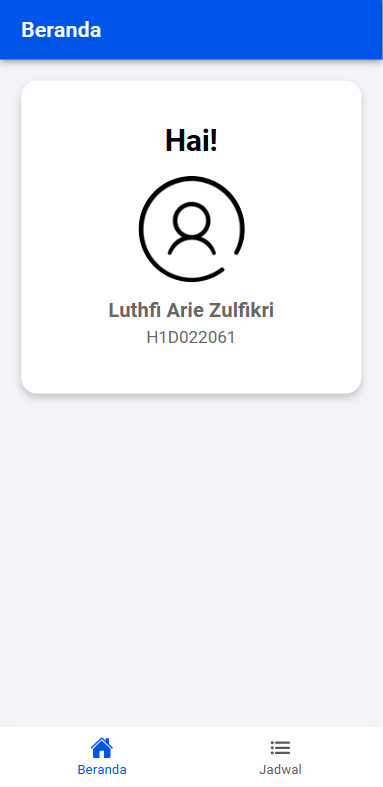

# Tugas 6 - Pertemuan 7

- **Nama** : Luthfi Arie Zulfikri
- **NIM** : H1D022061
- **Shift Lama** : A
- **Shift Baru** : A

---

# Screenshot Hasil

<p align="center">
  
  
</p>

---

# Cara Menambah Komponen di Ionic

Misalkan akan menambahkan komponen pada halaman Ionic `tab1` menggunakan template tab. Halaman `tab1` biasanya terletak di dalam folder `src/app/tab1`. Di dalam folder ini terdapat file `tab1.page.html`, `tab1.page.scss`, dan `tab1.page.ts` yang masing-masing digunakan untuk markup, styling, dan logika halaman. Kemudian Tambahkan komponen yang diinginkan pada file `tab1.page.html`. Berikut adalah kode yang saya tambahkan ditambahkan untuk menampilkan header, card profile, dan informasi pengguna seperti nama dan nomor ID.

```html
<ion-header [translucent]="true">
  <ion-toolbar color="primary">
    <ion-title text-center> Beranda </ion-title>
  </ion-toolbar>
</ion-header>

<ion-content [fullscreen]="true" color="light">
  <ion-card class="profile-card" mode="ios">
    <ion-card-header>
      <ion-card-title text-center>Hai!</ion-card-title>
    </ion-card-header>

    <ion-card-content class="content-center">
      <ion-avatar class="avatar-center">
        
      </ion-avatar>
      <h2 class="student-name">Luthfi Arie Zulfikri</h2>
      <p class="student-id">H1D022061</p>
    </ion-card-content>
  </ion-card>
</ion-content>
```

Untuk membuat tampilan lebih menarik, tambahkan kode CSS berikut ke dalam `tab1.page.scss`:

```css
.profile-card {
  margin: 20px;
  padding: 20px;
  text-align: center;
  border-radius: 15px;
  box-shadow: 0 4px 8px rgba(0, 0, 0, 0.2);
}

.avatar-center {
  margin: auto;
  width: 100px;
  height: 100px;
  overflow: hidden;
  border-radius: 50%;
  margin-bottom: 15px;
}

.student-name {
  font-size: 1.2em;
  font-weight: bold;
  margin-top: 10px;
}

.student-id {
  font-size: 1em;
  color: #666;
}
```

Begitu juga cara menambahkan komponen ionic pada halaman tab lainnya.
